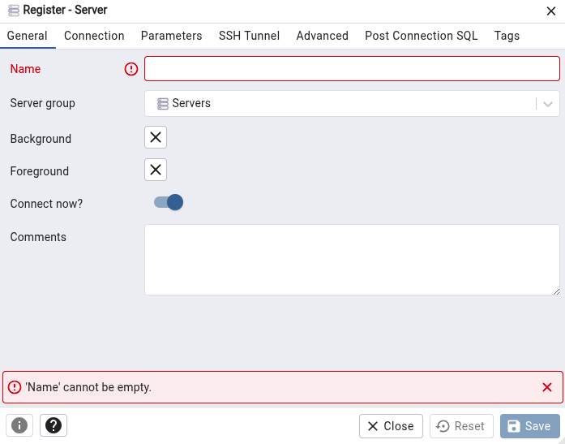
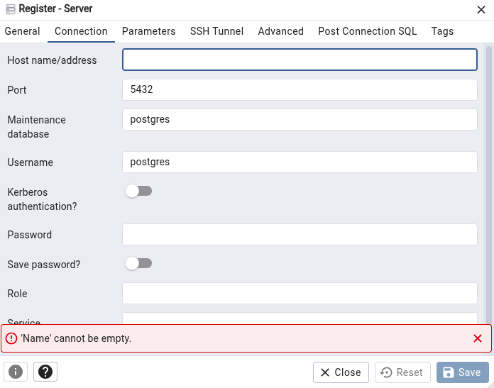

#  **PostgreSQL**

## 📥 Installation

### 🐧 **Linux**

```bash
sudo apt install postgresql postgresql-contrib
```

```bash
sudo -i -u postgres
psql
```

### 🪟 **Windows**

[Lien de téléchargement PostgreSQL](https://www.postgresql.org/download/windows/)

## 🔧 Configuration

```bash
sudo -u postgres psql
```

```SQL
CREATE USER votre_utilisateur WITH PASSWORD 'votre_mot_de_passe';
```

```SQL
GRANT ALL PRIVILEGES ON DATABASE votre_base_de_donnees TO votre_utilisateur;
```

##  **Commandes SQL**

**Création de table :**

```SQL
CREATE DATABASE nom_de_bdd;
```

```SQL
CREATE TABLE "User"(
   user_id UUID PRIMARY KEY,
   user_name VARCHAR(20) NOT NULL UNIQUE,
   user_mail VARCHAR(64) NOT NULL UNIQUE,
   user_password VARCHAR(128) NOT NULL
);
```

**Insérer dans une table :**

```SQL
INSERT INTO "User" (user_id, user_name, user_mail, user_password)
VALUES (
   gen_random_uuid(),
   'axel',
   'axel@mail.com',
   'mypassword'
);
```

**Vérifier les éléments dans une table :**

```SQL
SELECT * FROM "User";
```

**Modifier des éléments dans une table :**

```SQL
UPDATE "User" SET user_mail = 'newmail@mail.com' WHERE user_name = 'axel';
```

**Supprimer une colonne précise :**

```SQL
DELETE FROM "User" WHERE user_name = 'axel';
```

**Supprimer une table :**

```SQL
DROP TABLE "User";
```

**Clé étrangère :**

```SQL
CREATE TABLE "Post"(
   post_id UUID PRIMARY KEY,
   post_title VARCHAR(50) NOT NULL,
   post_description VARCHAR(250) NOT NULL,
   user_id UUID NOT NULL UNIQUE,
   FOREIGN KEY (user_id) REFERENCES User(user_id)
);
```

_ou_

```SQL
ALTER TABLE "Post" ADD CONSTRAINT user_id FOREIGN KEY (user_id) REFERENCES "User"(user_id);
```

## 🐘 **Commandes PSQL**

| Commande        | Description                                |
| --------------- | ------------------------------------------ |
| `\l` ou `\list` | Liste les bases de données                 |
| `\c nom_base`   | Se connecter à une base                    |
| `\conninfo`     | Informations de connexion actuelles        |
| `\dt`           | Liste les tables                           |
| `\dt+`          | Liste les tables avec détails              |
| `\dv`           | Liste les vues                             |
| `\d nom_table`  | Description d’une table                    |
| `\d+ nom_table` | Détails étendus sur une table              |
| `\di`           | Liste les index                            |
| `\ds`           | Liste les séquences                        |
| `\df`           | Liste les fonctions                        |
| `\dn`           | Liste les schémas                          |
| `\du`           | Liste les rôles utilisateurs               |
| `\dx`           | Liste les extensions installées            |
| `\d`            | Liste tous les objets dans le schéma actif |
| `\d nom_objet`  | Description d’un objet                     |

## 🏷️ **Types de données PostgreSQL**

| **Catégorie**                        | **Type**                | **Description**                                                                                                                |
| ------------------------------------ | ----------------------- | ------------------------------------------------------------------------------------------------------------------------------ |
| **Types numériques avancés**         | `bigint`                | Un entier plus grand que `int`.                                                                                                |
|                                      | `serial` et `bigserial` | Types d'entiers auto-incrémentés, souvent utilisés pour les clés primaires.                                                    |
|                                      | `numeric` ou `decimal`  | Pour les calculs avec une grande précision, souvent utilisé pour les montants d'argent.                                        |
|                                      | `double precision`      | Un nombre à virgule flottante de précision double.                                                                             |
|                                      | `money`                 | Un type pour représenter des valeurs monétaires avec une précision fixe.                                                       |
| **Types de texte et de chaînes**     | `text`                  | Texte de longueur variable sans limite spécifique.                                                                             |
|                                      | `varchar(n)`            | Chaîne de caractères avec une longueur maximale définie.                                                                       |
|                                      | `char(n)`               | Chaîne de caractères de longueur fixe (souvent utilisé pour des codes de taille fixe).                                         |
| **Types de date et d'heure**         | `date`                  | Représente une date sans heure.                                                                                                |
|                                      | `timestamp`             | Représente une date et une heure sans fuseau horaire.                                                                          |
|                                      | `timestamptz`           | Représente une date et une heure avec un fuseau horaire.                                                                       |
|                                      | `time`                  | Représente uniquement l'heure sans date.                                                                                       |
|                                      | `timetz`                | Représente l'heure avec un fuseau horaire.                                                                                     |
|                                      | `interval`              | Représente un intervalle de temps (par exemple, `2 days 3 hours`).                                                             |
| **Types booléens**                   | `boolean`               | Représente une valeur `true`, `false` ou `NULL`.                                                                               |
| **Types de tableaux**                | `array`                 | Permet de stocker plusieurs éléments du même type dans une seule colonne.                                                      |
| **Types de géométrie et géospatial** | `point`                 | Représente un point dans un plan à deux dimensions.                                                                            |
|                                      | `line`                  | Représente une ligne dans un plan.                                                                                             |
|                                      | `lseg`                  | Représente un segment de ligne.                                                                                                |
|                                      | `box`                   | Représente un rectangle dans un plan.                                                                                          |
|                                      | `path`                  | Représente un chemin, qui peut être ouvert ou fermé.                                                                           |
|                                      | `polygon`               | Représente un polygone.                                                                                                        |
|                                      | `circle`                | Représente un cercle.                                                                                                          |
| **Types JSON**                       | `json`                  | Représente des données JSON sous forme de texte brut.                                                                          |
|                                      | `jsonb`                 | Représente des données JSON sous forme binaire, permettant des recherches plus rapides.                                        |
| **Types de données de réseau**       | `cidr`                  | Représente un réseau IPv4 ou IPv6.                                                                                             |
|                                      | `inet`                  | Représente une adresse IP, avec ou sans réseau.                                                                                |
|                                      | `macaddr`               | Représente une adresse MAC.                                                                                                    |
| **Types UUID**                       | `uuid`                  | Représente un identifiant unique universel (UUID).                                                                             |
| **Types de données composites**      | `composite types`       | Permet de définir des types de données complexes en combinant plusieurs types simples.                                         |
| **Types de données HSTORE**          | `hstore`                | Un type clé-valeur permettant de stocker des données semi-structurées, comme des paires clé-valeur.                            |
| **Types de données RANGE**           | `int4range`             | Un intervalle de valeurs d'entiers.                                                                                            |
|                                      | `int8range`             | Un intervalle de valeurs d'entiers longs.                                                                                      |
|                                      | `numrange`              | Un intervalle de valeurs numériques.                                                                                           |
|                                      | `tsrange`               | Un intervalle de valeurs de timestamps sans fuseau horaire.                                                                    |
|                                      | `tstzrange`             | Un intervalle de timestamps avec fuseau horaire.                                                                               |
|                                      | `daterange`             | Un intervalle de valeurs de dates.                                                                                             |
| **Types Enum**                       | `enum`                  | Permet de définir un type énuméré avec un ensemble limité de valeurs possibles (par exemple, `enum color {red, green, blue}`). |
| **Types Large Object**               | `bytea`                 | Permet de stocker des données binaires de taille variable (par exemple, des fichiers, des images).                             |

# **pgAdmin**

## 📥 Installation

```bash
curl https://www.pgadmin.org/static/packages_pgadmin_org.pub | sudo gpg --dearmor -o /usr/share/keyrings/pgadmin-keyring.gpg
```

```bash
echo "deb [signed-by=/usr/share/keyrings/pgadmin-keyring.gpg] https://ftp.postgresql.org/pub/pgadmin/pgadmin4/apt/jammy pgadmin4 main" | sudo tee /etc/apt/sources.list.d/pgadmin4.list
```

```bash
sudo apt update
```

```bash
sudo apt install pgadmin4-desktop
```

## ⚙️ Setup PgAdmin4

- Lors de l'ouverture de PgAdmin4, vous devrez créer un serveur, cliquez donc sur `Add New Server`


- Lorsque vous avez cliquer sur ce bouton, une fenếtre s'ouvrira où il vous sera demander de rentrer un nom de serveur :



- Entrez le nom du serveur que vous voulez. _(ex: test)_

- A la suite de ça, vous aurez besoin de configurer la connection via l'onglet **"Connection"** situé à droite de **"General"** vu plus haut dans le screenshot. A l'intérieur de celui-ci, vous devrez rentrer le host name _(ex : localhost)_, ainsi que mettre en **_username_** le nom que vous vous êtes attribué dans **psql** et remplir le password que vous avez aussi précedemment créer.


